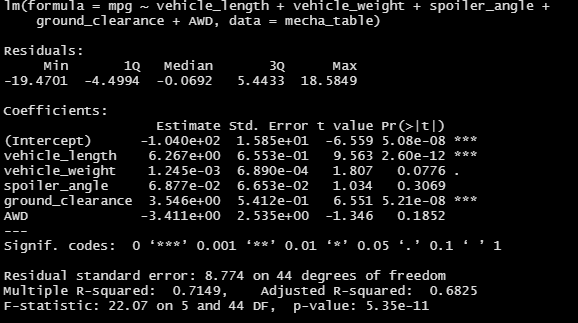
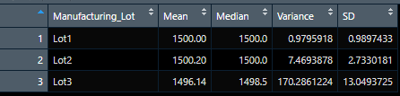

# MechaCar_Statistical_Analysis

AutosRUs' newest prototype, the MechaCar, is having production issues that is halting the manufacturing team's progress. The production data is available for review, and the goal of this analysis is to provide insights that could help the manufacturing team

## Linear Regression to Predict MPG
Fifty prototypes were produced using multiple design specs to identify ideal vehicle performance.
Multiple metrics, such as vehicle length, vehicle weight, spoiler angle, drivetrain, and ground clearance, were collected for each vehicle

### Figure 1 - Linear Regression Model with Multiple Metrics on MPG
</img>

Which variables/coefficients provided a non-random amount of variance to the mpg values in the dataset?

Is the slope of the linear model considered to be zero? Why or why not?

Does this linear model predict mpg of MechaCar prototypes effectively? Why or why not?

## Summary Statistics on Suspension Coils

### Figure 2 - Total Summary Statistics on Suspension Coil PSI
</img>

### Figure 3 - Summary Statistics on Suspension Coil PSI by Lot
</img>

The design specifications for the MechaCar suspension coils dictate that the variance of the suspension coils must not exceed 100 pounds per square inch. Does the current manufacturing data meet this design specification for all manufacturing lots in total and each lot individually? Why or why not?