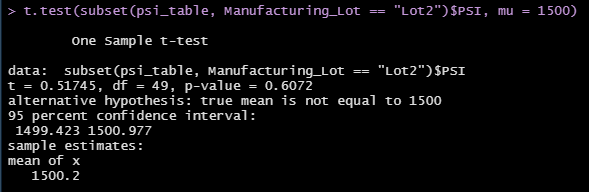

# MechaCar_Statistical_Analysis

AutosRUs' newest prototype, the MechaCar, is having production issues that is halting the manufacturing team's progress. The production data is available for review, and the goal of this analysis is to provide insights that could help the manufacturing team

## Linear Regression to Predict MPG
Fifty prototypes were produced using multiple design specs to identify ideal vehicle performance.
Multiple metrics, such as vehicle length, vehicle weight, spoiler angle, drivetrain, and ground clearance, were collected for each vehicle

### Figure 1 - Linear Regression Model with Multiple Metrics on MPG
</img>

Which variables/coefficients provided a non-random amount of variance to the mpg values in the dataset?

Is the slope of the linear model considered to be zero? Why or why not?

Does this linear model predict mpg of MechaCar prototypes effectively? Why or why not?

## Summary Statistics on Suspension Coils

### Figure 2 - Total Summary Statistics on Suspension Coil PSI
</img>

### Figure 3 - Summary Statistics on Suspension Coil PSI by Lot
</img>

The design specifications for the MechaCar suspension coils dictate that the variance of the suspension coils must not exceed 100 pounds per square inch. Does the current manufacturing data meet this design specification for all manufacturing lots in total and each lot individually? Why or why not?

## T-Tests on Suspension Coils

The population mean for the MechaCar suspension coils manufactured is 1,500 pounds per square inch. By using Student's t-Test, we can determine if all manufacturing lots and each lot individually are statistically different from the population mean of 1,500 pounds per square inch.

 ### Figure 4 - PSI Across All Manufacturing Lots
</img>

 ### Figure 5 - PSI Across Lot 1
</img>

 ### Figure 6 - PSI Across Lot 2
</img>

 ### Figure 7 - PSI Across Lot 3
</img>

Using a standard significance level of 0.05, only one out of the four t-test that was ran showed a p-value where we would be able to reject our null hypothesis - Lot 3. 

The PSI across all Lots, as well as Lots 1-2 showed a p-values greater than 0.05, which evidence shows that their means are statistically similar to the population mean of 1,500

Because Lot 3 shows a lower p-value compared to our significance level, we should accept the alternative hypothesis that this lot does not fall within our confidence level of PSI, and should be inspected. 

## Study Design: MechaCar vs Competition

What metric or metrics are you going to test?
What is the null hypothesis or alternative hypothesis?
What statistical test would you use to test the hypothesis? And why?
What data is needed to run the statistical test?